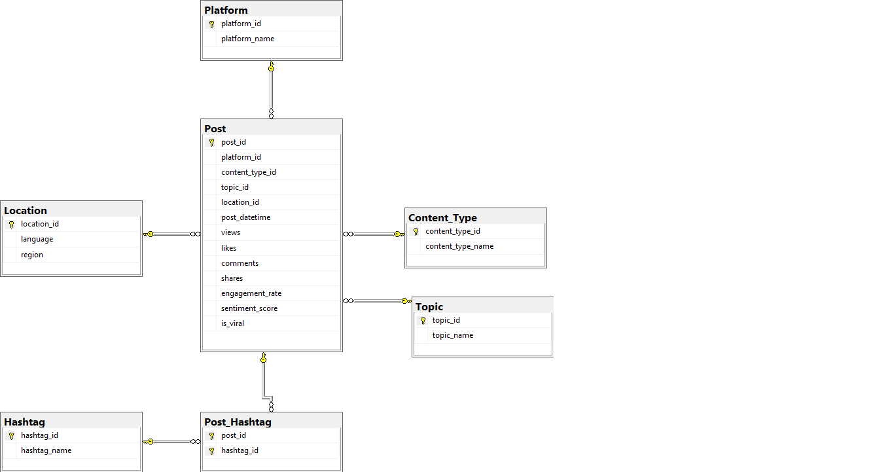

# ViralVerse 📱🔥

### A Relational Database for Understanding Social Media Virality

ViralVerse is an RDBMS project built using Microsoft SQL Server to analyze social media content, engagement, hashtags, platforms, topics, languages, and regions.

## 🎯 Objective

The objective of this project is to design a normalized relational database and use SQL queries to identify patterns associated with viral social media content.

## 📊 Dataset

The project uses the **Social Media Viral Content & Engagement Metrics** dataset from Kaggle.

The dataset contains 2,000 social media posts and 15 attributes including:

- Platform
- Content Type
- Topic
- Language
- Region
- Post Date/Time
- Hashtags
- Views
- Likes
- Comments
- Shares
- Engagement Rate
- Sentiment Score
- Viral Status

## 📌 Dataset Source

This project uses the **Social Media Viral Content & Engagement Metrics** dataset from Kaggle.

🔗 **Dataset:** [Social Media Viral Content & Engagement Metrics](https://www.kaggle.com/datasets/aliiihussain/social-media-viral-content-and-engagement-metrics?resource=download)

The original dataset was imported into a staging table and then transformed into a normalized relational database for SQL Server analysis.

The dataset is used for educational and academic purposes.

## 🛠️ Technology

- Microsoft SQL Server
- SQL
- Kaggle Dataset
- GitHub

## 🗄️ Database Design

The database contains the following normalized tables:

- Platform
- Content_Type
- Topic
- Location
- Post
- Hashtag
- Post_Hashtag

The `Post_Hashtag` table represents the many-to-many relationship between posts and hashtags.

## 🔑 RDBMS Concepts Demonstrated

This project demonstrates practical use of:

- Primary Keys
- Foreign Keys
- UNIQUE Constraints
- Composite Primary Keys
- Referential Integrity
- Normalization
- First Normal Form (1NF)
- Second Normal Form (2NF)
- Third Normal Form (3NF)
- One-to-Many Relationships
- Many-to-Many Relationships
- Junction Tables
- Aggregate Functions
- JOIN operations
- GROUP BY
- HAVING
- ORDER BY
- Subqueries
- CASE expressions
- Conditional Aggregation
- `STRING_SPLIT()`

## 🔍 SQL Analysis

The database can answer questions such as:

- Which platform has the highest average engagement?
- Which platform has the highest percentage of viral posts?
- Which topics generate the most viral posts?
- Which content type receives the highest average views?
- Which hashtags are most frequently associated with viral posts?
- Which regions have the most viral posts?
- How does sentiment differ between viral and non-viral posts?
- Which viral posts have engagement above the overall average?
- How do platforms compare across different topics?
- Which platform has the highest-viewed viral content?

---
## 💻 SQL Queries

The project includes SQL queries covering different levels of analysis:

### Basic Queries
- Filtering viral posts
- Sorting posts by views and engagement
- Platform-specific analysis

### Aggregate Analysis
- Platform-wise post counts
- Average engagement rates
- Topic-wise average views
- Viral post counts

### Relational Queries
- JOINing posts with platforms, topics, content types, and locations
- Connecting posts with hashtags through the junction table

### Advanced Analysis
- Subqueries
- HAVING clauses
- Conditional aggregation
- Viral percentage calculations
- Comparison of viral and non-viral content
- Cross-platform and topic-level analysis

## 📈 Key Findings

Analysis of the dataset revealed several interesting patterns:

- **X** had the highest average engagement rate among the platforms in the dataset, at approximately **20.10%**.
- **YouTube Shorts** had the highest number of viral posts in the dataset.
- Viral content was analyzed across different **platforms, topics, content types, languages, and regions**.
- Hashtags were separated into their own entity and connected to posts through a junction table, allowing hashtag-level analysis.
- Platform-wise viral percentages were calculated to compare the proportion of posts classified as viral across platforms.

> **Note:** These findings describe patterns within this particular dataset and should not be interpreted as representing all social media users or platforms.

---

## 📐 ER Diagram



## 📁 Project Structure

```text
ViralVerse/
│
├── ViralVerse_Complete.sql
├── ER_Diagram.png
└── README.md
